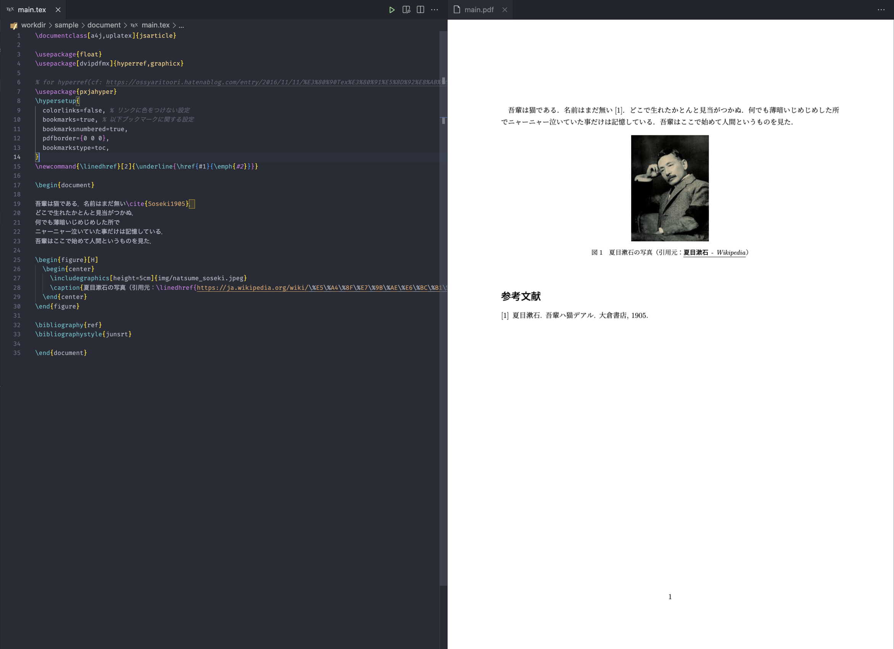

# LaTeX in Docker on VSCode

Docker + Visual Studio Code で快適な LaTeX 執筆環境を構築するリポジトリ

以下の Docker イメージをベースとしている。TeX Live 2022 を使用。

- Docker image
  - GitHub: [nukopy/ubuntu-texlive-ja](https://github.com/nukopy/ubuntu-texlive-ja)
  - Docker Hub: [nukopy/ubuntu-texlive-ja](https://hub.docker.com/repository/docker/nukopy/ubuntu-texlive-ja)

## このリポジトリの目的

- Docker / Docker Compose / TeX Live による煩雑な LaTeX 執筆環境構築の簡易化
- Latexmk による LaTeX のソースコードのビルド設定の簡易化
- VSCode extension "LaTeX Workshop" を利用した LaTeX 執筆環境の快適化
  - linter
  - latexindent による自動フォーマット
  - PDF プレビュー
  - 数式のプレビュー

## Overview

サンプルプロジェクトとして、一般的な LaTeX 文書、Beamer によるスライドの 2 つのソースコードを用意してある。本リポジトリによって構築した LaTeX 環境における VSCode での執筆の様子は以下の通り。画面左側にソースコード、画面右側に生成された PDF ファイルを表示しながら LaTeX 文書を執筆することができる。

- 一般的な LaTeX 文書の執筆環境



- Beamer によるスライドの執筆環境


## 環境構築

### 必要なソフトウェア

下記に列挙したソフトウェアを事前にインストールする必要がある。ソフトウェアは全て最新バージョンであることを前提としている。

- Docker
- Docker Compose
- Visual Studio Code (VSCode)
- VSCode Extensions
  - Remote - Containers
  - LaTeX Workshop

### 手順

環境構築手順は以下の通り。

1. 本リポジトリの `Use this template` ボタンをクリックし、新しくリポジトリを作成する
2. 作成したリポジトリを clone し、VSCode で開く

   ```sh
   git clone [Your Repository URL]
   cd [Your Repository Name]
   ```

3. cmd + shift + P（`Show All Commands` ショートカット）で **"Remote-Containers: Reopen in Container"** を検索し実行すると、Docker コンテナのビルドが実行され、リモート環境を開いた状態でエディタが起動する
   - 別途パッケージが必要な場合、`.devcontainer/Dockerfile` を編集してからビルドする
4. PDF プレビューを開く：`src/main.tex` を開いた状態にし、cmd + shift + P で **"LaTeX Workshop: View LaTeX PDF file"** を検索し実行すると、画面右側に LaTeX 文書から生成された PDF が表示される（エディタ右上の虫眼鏡ボタンを押してもプレビューを表示できる）。
5. 後は自由に LaTeX ソースを作成・編集するだけ。サンプルプロジェクトとして [`sample`](https://github.com/nukopy/latex-in-docker-on-vscode/tree/master/sample) ディレクトリ配下にドキュメント作成用プロジェクト、Beamer によるスライド作成用プロジェクトを用意してあるため、そちらも参考に。
   - デフォルトのビルド設定では処理系として **upLaTeX** を使用している。これを変更する場合、`.latexmkrc` を編集する必要がある。場合によっては `Dockerfile` に処理系をインストールする処理を追加する必要がある。
